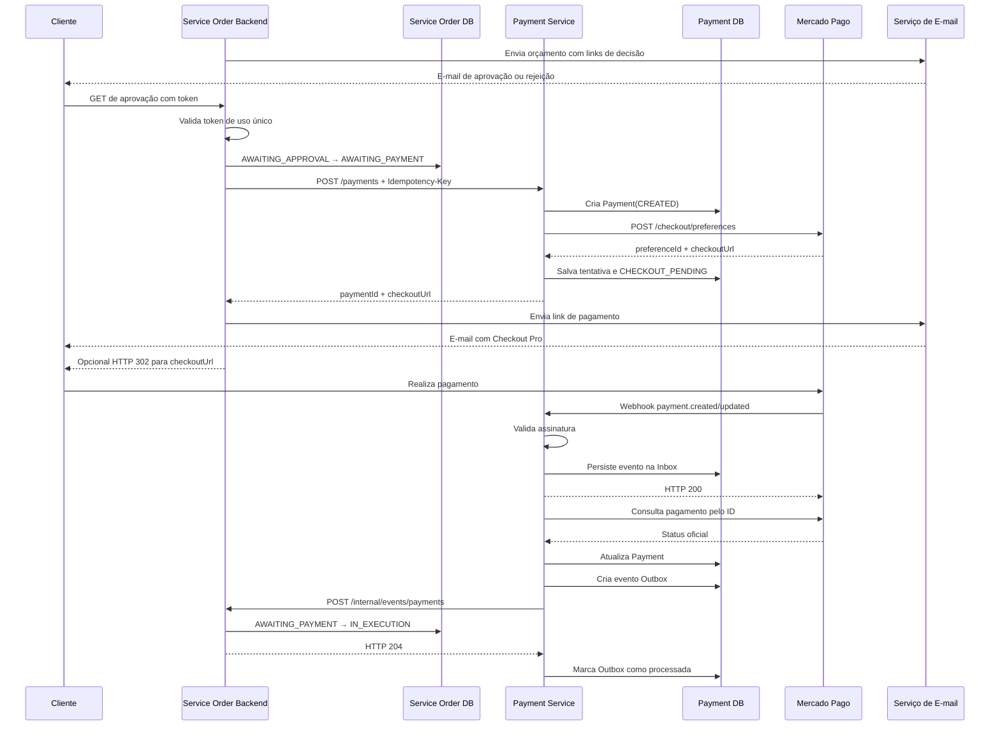

# PitFlow Payment Service — Definições Arquiteturais e Plano de Execução

## 1. Objetivo deste documento

Este documento consolida as decisões arquiteturais, regras de negócio, contratos, responsabilidades e etapas de implementação do microserviço de pagamentos do **PitFlow OS**.

Ele deve ser utilizado como referência durante toda a construção do serviço. A cada etapa, a implementação deverá ser comparada com estas definições para evitar desvios de escopo, acoplamento indevido ou duplicação de responsabilidades.

O novo serviço será chamado inicialmente de:

```text
pitflow-payment-service
```

O serviço será independente do `pitflow-os-backend`, terá banco de dados próprio e será responsável pela integração com o **Mercado Pago Checkout Pro**.

---

## 2. Contexto atual

O `pitflow-os-backend` gerencia:

- clientes;
- veículos;
- peças e serviços;
- mecânicos;
- autenticação;
- ordens de serviço;
- diagnóstico;
- aprovação ou rejeição do orçamento;
- execução e entrega da ordem de serviço;
- envio de e-mails.

A aplicação atual utiliza:

- Java 21;
- Spring Boot;
- Maven;
- PostgreSQL;
- Liquibase;
- Clean Architecture;
- DDD;
- Docker e Docker Compose;
- Kubernetes;
- AWS;
- OpenAPI/Swagger;
- Spring Security;
- JWT;
- Spring Actuator;
- Micrometer.

O novo serviço deverá seguir as mesmas convenções arquiteturais sempre que forem aplicáveis.

---

## 3. Decisões principais

### 3.1. O pagamento será um microserviço independente

O serviço de pagamentos deverá:

- possuir repositório próprio;
- possuir aplicação Spring Boot própria;
- possuir banco PostgreSQL próprio;
- possuir migrations Liquibase próprias;
- possuir pipeline de build e deploy próprio;
- não acessar diretamente tabelas do `pitflow-os-backend`;
- não compartilhar entidades JPA com o `pitflow-os-backend`;
- não possuir foreign keys para tabelas pertencentes ao backend de ordens;
- comunicar-se com os demais serviços apenas por contratos explícitos.

Mesmo que os dois bancos utilizem a mesma instância PostgreSQL ou RDS por limitação acadêmica, cada serviço deverá possuir:

- database ou schema próprio;
- usuário próprio;
- credenciais próprias;
- migrations próprias;
- responsabilidade exclusiva sobre suas tabelas.

### 3.2. Banco de dados

O banco escolhido será:

```text
PostgreSQL
```

Não será utilizado MongoDB nesta primeira versão.

Motivos:

- necessidade de consistência;
- idempotência por constraints únicas;
- transições de estado;
- auditoria financeira;
- valores monetários;
- transações locais;
- padrões Inbox e Outbox;
- controle de concorrência;
- capacidade de armazenar payloads externos em `JSONB`;
- facilidade de execução local com Docker Compose;
- alinhamento com a stack atual do projeto.

### 3.3. Integração híbrida

A integração não será somente síncrona.

#### Parte síncrona

```text
Service Order Backend
    → Payment Service
        → Mercado Pago
```

Será utilizada para criar a cobrança e obter a URL do Checkout Pro.

#### Parte assíncrona

```text
Mercado Pago
    → webhook do Payment Service
        → callback para o Service Order Backend
```

Será utilizada para atualizar o status após o cliente realizar o pagamento.

### 3.4. Sem frontend próprio

Não será criado um frontend separado.

O projeto utilizará:

- links enviados por e-mail;
- endpoints HTTP do próprio backend;
- redirecionamento HTTP quando necessário;
- páginas hospedadas pelo Mercado Pago Checkout Pro;
- respostas simples do backend, como texto, HTML mínimo ou redirecionamento.

Não será necessário expor uma aplicação frontend adicional nem criar outro deployment apenas para interface.

### 3.5. Checkout Pro

Será utilizado:

```text
Mercado Pago Checkout Pro
```

O Payment Service criará uma preferência e receberá:

- `preference_id`;
- `init_point`;
- `sandbox_init_point`.

O backend deverá selecionar a URL apropriada conforme o ambiente:

- teste: `sandbox_init_point`;
- produção: `init_point`.

O cliente realizará o pagamento na página hospedada pelo Mercado Pago.

---

## 4. Momento da criação do pagamento

A preferência do Mercado Pago **não será criada junto com a criação inicial da Ordem de Serviço**.

Motivo: no momento em que a OS é criada, o diagnóstico pode ainda não ter sido realizado e o valor final pode mudar após a inclusão de peças e serviços.

A cobrança será criada somente depois de:

1. o diagnóstico ser concluído;
2. o orçamento possuir valor final;
3. o orçamento ser enviado ao cliente;
4. o cliente aprovar o orçamento.

Assim, evita-se:

- criar cobranças para orçamentos rejeitados;
- enviar links com valores antigos;
- manter múltiplas preferências desnecessárias;
- cancelar cobranças sempre que o orçamento for alterado;
- permitir que o cliente pague um valor desatualizado.

---

## 5. Máquina de estados da Ordem de Serviço

### 5.1. Status atuais

```java
public enum Status {
    RECEIVED,
    IN_DIAGNOSIS,
    AWAITING_APPROVAL,
    IN_EXECUTION,
    FINISHED,
    DELIVERED,
    CANCELLED
}
```

### 5.2. Novo status

Será adicionado:

```java
AWAITING_PAYMENT
```

O enum passará a ser:

```java
public enum Status {
    RECEIVED,
    IN_DIAGNOSIS,
    AWAITING_APPROVAL,
    AWAITING_PAYMENT,
    IN_EXECUTION,
    FINISHED,
    DELIVERED,
    CANCELLED
}
```

### 5.3. Fluxo principal

```text
RECEIVED
    ↓
IN_DIAGNOSIS
    ↓
AWAITING_APPROVAL
    ↓ cliente aprova o orçamento
AWAITING_PAYMENT
    ↓ Mercado Pago confirma o pagamento
IN_EXECUTION
    ↓
FINISHED
    ↓
DELIVERED
```

### 5.4. Fluxos alternativos

#### Orçamento rejeitado

```text
AWAITING_APPROVAL
    ↓
CANCELLED
```

#### Pagamento recusado

```text
AWAITING_PAYMENT
    ↓ tentativa recusada
AWAITING_PAYMENT
```

Uma tentativa recusada não deverá cancelar automaticamente a OS.

O cliente poderá:

- tentar novamente;
- utilizar outro meio de pagamento;
- receber uma nova tentativa de checkout, conforme a política definida.

#### Pagamento expirado

```text
AWAITING_PAYMENT
    ↓ preferência expirada
AWAITING_PAYMENT
```

O backend poderá solicitar uma nova tentativa ao Payment Service.

### 5.5. Separação entre status operacional e financeiro

O status da Ordem de Serviço representa o fluxo operacional da oficina.

O Payment Service será a fonte de verdade sobre o status financeiro detalhado.

Opcionalmente, o `pitflow-os-backend` poderá manter uma projeção simplificada:

```java
public enum ServiceOrderPaymentStatus {
    NOT_REQUESTED,
    CREATION_PENDING,
    PENDING,
    PAID,
    REJECTED,
    CANCELLED,
    REFUNDED
}
```

Essa projeção não substitui o estado mantido pelo Payment Service. Ela serve apenas para:

- consulta local;
- decisão de fluxo;
- exibição no backend;
- evitar consultas síncronas ao serviço de pagamentos em toda requisição.

---

## 6. Fluxo de e-mails

Serão utilizados dois momentos de comunicação.

### 6.1. Primeiro e-mail: aprovação do orçamento

O cliente receberá um e-mail com:

- resumo do orçamento;
- valor;
- link de aprovação;
- link de rejeição.

Exemplo:

```text
Seu orçamento está pronto.

Valor total: R$ 650,00

[Aprovar orçamento]
[Rejeitar orçamento]
```

### 6.2. Segundo e-mail: pagamento

Após a aprovação do orçamento e a criação da preferência, o cliente receberá:

```text
Seu orçamento foi aprovado.

Para iniciar o serviço, realize o pagamento:

[Realizar pagamento]
```

O botão apontará para a URL do Checkout Pro.

### 6.3. Redirecionamento opcional

Como não haverá frontend, o endpoint de aprovação também poderá:

1. validar o token;
2. aprovar o orçamento;
3. alterar a OS para `AWAITING_PAYMENT`;
4. criar o pagamento;
5. receber a URL do Checkout Pro;
6. responder com HTTP `302 Found`;
7. redirecionar diretamente para o Mercado Pago.

Mesmo com o redirecionamento, o segundo e-mail deverá ser enviado como contingência.

Isso cobre casos em que:

- o cliente fecha o navegador;
- a conexão cai;
- o redirecionamento falha;
- o Mercado Pago fica temporariamente indisponível;
- o cliente decide pagar mais tarde.

---

## 7. Decisão sobre os links GET de aprovação e rejeição

O projeto continuará utilizando links `GET` enviados por e-mail, pois não haverá frontend separado.

Exemplo atual:

```http
GET /external/events/service-orders/decision?token=...
```

Essa decisão é aceita como restrição consciente do projeto acadêmico.

### 7.1. Risco conhecido

Ferramentas de segurança, provedores de e-mail e scanners antiphishing podem abrir links automaticamente.

Como a rota modifica estado, um scanner poderia acionar uma decisão antes do cliente.

### 7.2. Mitigações obrigatórias

O token de decisão deverá:

- possuir expiração curta;
- ser assinado;
- ser de uso único;
- conter o `serviceOrderId`;
- conter a decisão permitida;
- conter um identificador único;
- não permitir alteração da decisão via query parameter;
- ser invalidado após processamento;
- produzir resposta idempotente em chamadas repetidas;
- registrar data, IP e User-Agent para auditoria;
- rejeitar token expirado;
- rejeitar token já utilizado;
- rejeitar token incompatível com o estado atual da OS.

Exemplo de claims:

```json
{
  "jti": "UUID",
  "serviceOrderId": "UUID",
  "decision": "APPROVED",
  "exp": 1784073600
}
```

A decisão deverá estar dentro do token. Não deverá ser aceita uma decisão arbitrária enviada pelo cliente fora do conteúdo assinado.

### 7.3. Possível evolução futura

Sem criar um frontend separado, o próprio backend poderá retornar uma página HTML mínima para confirmação e somente depois receber um `POST`.

Essa evolução é mais segura, mas não será obrigatória para a primeira versão.

---

## 8. Fluxo completo aprovado



---

## 9. Limites de responsabilidade

### 9.1. Service Order Backend

Responsável por:

- clientes;
- dados da oficina;
- ordens de serviço;
- orçamento;
- aprovação e rejeição do orçamento;
- estado operacional da OS;
- envio dos e-mails;
- criação da solicitação de pagamento;
- armazenamento da referência `paymentId`;
- recebimento do evento financeiro;
- transição para `IN_EXECUTION`.

Não deverá:

- chamar diretamente APIs do Mercado Pago;
- armazenar Access Token do Mercado Pago;
- processar assinatura do webhook do Mercado Pago;
- controlar tentativas detalhadas de pagamento;
- acessar as tabelas do Payment Service.

### 9.2. Payment Service

Responsável por:

- criar a obrigação de pagamento;
- criar preferências no Mercado Pago;
- controlar tentativas;
- persistir URLs de checkout;
- receber webhooks;
- validar assinaturas;
- consultar o status oficial;
- mapear estados externos para estados internos;
- controlar idempotência;
- implementar Inbox;
- implementar Outbox;
- reconciliar pagamentos pendentes;
- notificar o Service Order Backend;
- auditar alterações financeiras.

Não deverá:

- gerenciar clientes;
- gerenciar veículos;
- gerenciar a OS completa;
- enviar o e-mail de orçamento;
- decidir regras de execução da oficina;
- consultar diretamente o banco da OS;
- alterar tabelas pertencentes ao outro serviço.

### 9.3. Mercado Pago

Responsável por:

- hospedar o Checkout Pro;
- coletar dados do meio de pagamento;
- processar a transação;
- disponibilizar o status;
- enviar notificações;
- fornecer identificadores externos.

---

## 10. Modelo de domínio do Payment Service

### 10.1. Payment

Representa a obrigação financeira referente a uma OS e a uma versão de orçamento.

Campos mínimos:

```text
id
serviceOrderId
budgetVersion
externalReference
idempotencyKey
idempotencyPayloadHash
amount
currency
status
provider
payerEmail
approvedAt
createdAt
updatedAt
version
```

Regras:

- `amount` deve ser maior que zero;
- usar `BigDecimal`;
- moeda inicial permitida: `BRL`;
- `serviceOrderId` não será foreign key;
- `externalReference` será estável;
- uma chave de idempotência não poderá representar payloads diferentes;
- não permitir duas obrigações ativas para a mesma OS e versão de orçamento.

### 10.2. PaymentAttempt

Representa uma tentativa ou preferência do provedor.

Campos mínimos:

```text
id
paymentId
providerPreferenceId
providerPaymentId
checkoutUrl
providerStatus
providerStatusDetail
createdAt
updatedAt
expiresAt
```

Uma obrigação `Payment` poderá possuir mais de uma tentativa.

Isso permite:

- recriar checkout expirado;
- manter histórico;
- impedir que uma tentativa antiga substitua a atual;
- auditar recusas;
- armazenar diferentes IDs do provedor.

### 10.3. PaymentStatus

```java
public enum PaymentStatus {
    CREATED,
    CHECKOUT_PENDING,
    PENDING,
    IN_PROCESS,
    APPROVED,
    REJECTED,
    CANCELLED,
    REFUNDED,
    EXPIRED,
    ERROR
}
```

O enum do Mercado Pago não deverá aparecer no domínio.

### 10.4. PaymentProvider

```java
public enum PaymentProvider {
    MERCADO_PAGO
}
```

O enum permite futura expansão sem acoplar o domínio ao adapter atual.

---

## 11. Modelo de banco de dados

### 11.1. `payments`

```text
id UUID PK
service_order_id UUID NOT NULL
budget_version BIGINT NOT NULL
external_reference VARCHAR NOT NULL UNIQUE
idempotency_key VARCHAR NOT NULL UNIQUE
idempotency_payload_hash VARCHAR NOT NULL
amount NUMERIC(19,2) NOT NULL
currency CHAR(3) NOT NULL
status VARCHAR NOT NULL
provider VARCHAR NOT NULL
payer_email VARCHAR NOT NULL
approved_at TIMESTAMPTZ NULL
created_at TIMESTAMPTZ NOT NULL
updated_at TIMESTAMPTZ NOT NULL
version BIGINT NOT NULL
```

Constraint recomendada:

```sql
UNIQUE (service_order_id, budget_version)
```

A regra poderá ser refinada no futuro para permitir múltiplos pagamentos cancelados ou substituídos.

### 11.2. `payment_attempts`

```text
id UUID PK
payment_id UUID NOT NULL FK payments(id)
provider_preference_id VARCHAR NOT NULL UNIQUE
provider_payment_id VARCHAR NULL UNIQUE
checkout_url TEXT NOT NULL
provider_status VARCHAR NULL
provider_status_detail VARCHAR NULL
expires_at TIMESTAMPTZ NULL
created_at TIMESTAMPTZ NOT NULL
updated_at TIMESTAMPTZ NOT NULL
```

### 11.3. `webhook_events`

Tabela Inbox.

```text
id UUID PK
event_key VARCHAR NOT NULL UNIQUE
provider VARCHAR NOT NULL
provider_event_id VARCHAR NULL
provider_payment_id VARCHAR NULL
action VARCHAR NULL
payload JSONB NOT NULL
status VARCHAR NOT NULL
attempts INTEGER NOT NULL
received_at TIMESTAMPTZ NOT NULL
processed_at TIMESTAMPTZ NULL
next_attempt_at TIMESTAMPTZ NULL
last_error TEXT NULL
```

### 11.4. `outbox_events`

```text
id UUID PK
aggregate_id UUID NOT NULL
event_type VARCHAR NOT NULL
payload JSONB NOT NULL
status VARCHAR NOT NULL
attempts INTEGER NOT NULL
created_at TIMESTAMPTZ NOT NULL
processed_at TIMESTAMPTZ NULL
next_attempt_at TIMESTAMPTZ NULL
last_error TEXT NULL
```

---

## 12. Estrutura de pacotes sugerida

```text
src/main/java/br/com/pitflow
├── common
│   ├── core
│   │   ├── exception
│   │   └── gateway
│   └── infrastructure
│       ├── configuration
│       ├── exception
│       ├── security
│       └── transaction
└── payment
    ├── controller
    │   ├── dto
    │   ├── PaymentController.java
    │   └── MercadoPagoWebhookController.java
    ├── core
    │   ├── entity
    │   ├── enums
    │   ├── exception
    │   ├── gateway
    │   └── usecase
    │       ├── inputPort
    │       └── outputData
    ├── infrastructure
    │   ├── config
    │   ├── client
    │   │   ├── mercadopago
    │   │   └── serviceorder
    │   ├── persistence
    │   │   ├── adapter
    │   │   ├── entity
    │   │   ├── mapper
    │   │   └── repository
    │   ├── scheduling
    │   ├── security
    │   └── web
    │       └── dto
    └── presenter
        └── dto
```

O core não poderá importar:

- Spring;
- JPA;
- Jackson;
- Mercado Pago SDK;
- HTTP clients;
- classes de infraestrutura.

---

## 13. Gateways do core

Gateways mínimos:

```text
PaymentGateway
PaymentAttemptGateway
PaymentProviderGateway
WebhookEventGateway
OutboxEventGateway
ServiceOrderNotificationGateway
TransactionGateway
ClockGateway
```

### 13.1. PaymentProviderGateway

Responsabilidades conceituais:

```text
createCheckoutPreference
findPaymentByProviderId
```

Nenhum tipo do SDK do Mercado Pago poderá aparecer nas assinaturas.

Exemplo conceitual:

```java
public interface PaymentProviderGateway {

    CheckoutPreferenceResult createCheckoutPreference(
            CheckoutPreferenceCommand command
    );

    ProviderPaymentResult findPaymentByProviderId(
            String providerPaymentId
    );
}
```

---

## 14. Casos de uso

Casos de uso mínimos:

```text
CreatePayment
FindPaymentById
FindPaymentByServiceOrderId
CreatePaymentAttempt
ProcessMercadoPagoWebhook
ProcessPendingWebhookEvents
DispatchPaymentOutboxEvents
ReconcilePendingPayments
RetryPaymentCheckout
```

Implementações deverão seguir a convenção:

```text
CreatePaymentImp
FindPaymentByIdImp
...
```

---

## 15. Contratos REST do Payment Service

### 15.1. Criar pagamento

```http
POST /payments
X-Internal-Api-Key: <secret>
Idempotency-Key: payment:service-order:<serviceOrderId>:budget:<version>
Content-Type: application/json
```

Request:

```json
{
  "serviceOrderId": "4aab5fcc-0374-46f0-92b8-f2603407e21e",
  "budgetVersion": 3,
  "amount": 650.00,
  "currency": "BRL",
  "description": "Pagamento da Ordem de Serviço",
  "payerEmail": "cliente@exemplo.com"
}
```

Response:

```http
HTTP/1.1 201 Created
```

```json
{
  "paymentId": "5fced71a-51a4-40ef-89d4-370affc123bc",
  "serviceOrderId": "4aab5fcc-0374-46f0-92b8-f2603407e21e",
  "budgetVersion": 3,
  "status": "CHECKOUT_PENDING",
  "checkoutUrl": "https://sandbox.mercadopago.com.br/checkout/...",
  "createdAt": "2026-07-15T02:00:00Z"
}
```

Regras:

1. `Idempotency-Key` obrigatória;
2. mesma chave e mesmo payload retornam o recurso existente;
3. mesma chave e payload diferente retornam `409 Conflict`;
4. valor deve ser maior que zero;
5. moeda deve ser `BRL`;
6. `externalReference` deve ser derivada do `paymentId`;
7. o serviço deverá persistir antes de chamar o provedor;
8. falhas externas não deverão apagar o registro interno;
9. resposta não deverá expor credenciais ou payload sensível.

### 15.2. Consultar pagamento

```http
GET /payments/{paymentId}
X-Internal-Api-Key: <secret>
```

### 15.3. Consultar por OS

```http
GET /payments/by-service-order/{serviceOrderId}
X-Internal-Api-Key: <secret>
```

### 15.4. Recriar tentativa

```http
POST /payments/{paymentId}/attempts
X-Internal-Api-Key: <secret>
Idempotency-Key: <nova-chave>
```

Esse endpoint será necessário somente se a primeira preferência expirar ou precisar ser substituída.

### 15.5. Webhook Mercado Pago

```http
POST /webhooks/mercado-pago
```

O endpoint:

- será público;
- não exigirá JWT;
- não exigirá API key interna;
- validará assinatura do Mercado Pago;
- responderá rapidamente;
- persistirá o evento antes do processamento completo.

---

## 16. Webhook Mercado Pago

### 16.1. Validação

Validar:

```text
x-signature
x-request-id
data.id
```

Utilizar a implementação oficial disponibilizada pelo SDK ou a especificação oficial correspondente à versão utilizada.

Não inventar algoritmo próprio.

### 16.2. Fonte de verdade

O payload do webhook não será considerado fonte final.

Após validar e persistir o evento:

```text
Payment Service
    → GET do pagamento no Mercado Pago
```

O serviço deverá validar:

- `external_reference`;
- valor;
- moeda;
- recebedor, quando aplicável;
- ID do pagamento;
- status;
- status detail.

### 16.3. Idempotência

A mesma notificação poderá ser enviada mais de uma vez.

O serviço deverá:

- derivar `event_key`;
- criar constraint única;
- retornar `200` para eventos já recebidos;
- não repetir transições;
- não criar Outbox duplicada;
- não enviar callback duplicado sem a mesma chave idempotente.

### 16.4. Processamento

Fluxo recomendado:

```text
Receber
→ validar assinatura
→ persistir Inbox
→ responder HTTP 200
→ processar evento
→ consultar Mercado Pago
→ atualizar pagamento
→ criar Outbox
```

O processamento poderá ser síncrono no primeiro MVP, desde que a resposta seja rápida. A estrutura deverá permitir mover o processamento para scheduler ou executor interno sem alterar o domínio.

---

## 17. Callback para o Service Order Backend

Endpoint novo no backend de ordens:

```http
POST /internal/events/payments
X-Internal-Api-Key: <secret>
Content-Type: application/json
```

Payload:

```json
{
  "eventId": "26db680b-51af-48de-83fb-bd2cf5af5a77",
  "paymentId": "5fced71a-51a4-40ef-89d4-370affc123bc",
  "serviceOrderId": "4aab5fcc-0374-46f0-92b8-f2603407e21e",
  "providerPaymentId": "167654679039",
  "status": "APPROVED",
  "amount": 650.00,
  "currency": "BRL",
  "statusDetail": "accredited",
  "occurredAt": "2026-07-15T02:30:00Z"
}
```

Regras:

- `eventId` único;
- processamento idempotente;
- `paymentId` deve corresponder ao pagamento associado à OS;
- o valor deve ser validado;
- uma OS somente poderá entrar em execução a partir de `AWAITING_PAYMENT`;
- eventos inválidos deverão retornar erro sem alterar estado;
- o backend deverá armazenar eventos já processados ou outra chave idempotente.

### 17.1. Transição por pagamento aprovado

```text
AWAITING_PAYMENT
    ↓ payment APPROVED
IN_EXECUTION
```

### 17.2. Pagamento rejeitado

A OS permanece:

```text
AWAITING_PAYMENT
```

O evento poderá atualizar a projeção financeira local para `REJECTED`.

### 17.3. Reembolso

Reembolso será persistido no Payment Service.

A regra de impacto sobre uma OS já executada ou entregue ainda deverá ser definida. Não será automatizada no primeiro MVP.

---

## 18. Autenticação e segurança

### 18.1. Comunicação interna

Para a primeira versão:

```http
X-Internal-Api-Key
```

Uso:

```text
Service Order Backend → Payment Service
Payment Service → Service Order Backend
```

Requisitos:

- segredo em variável de ambiente;
- segredo no AWS Secrets Manager;
- segredo em Kubernetes Secret;
- comparação em tempo constante;
- nunca registrar o valor;
- rotação possível;
- endpoints internos separados dos endpoints públicos.

Evoluções possíveis:

- OAuth2 Client Credentials;
- mTLS;
- service mesh.

Essas evoluções não fazem parte do MVP.

### 18.2. Webhook

O webhook utilizará:

- assinatura do Mercado Pago;
- chave secreta específica;
- validação do request ID;
- validação do recurso consultado;
- proteção contra payload excessivo;
- logs sem dados sensíveis.

### 18.3. Token de decisão da OS

O token usado no e-mail é diferente da autenticação entre serviços.

Ele deverá ser:

- assinado;
- de uso único;
- expirar;
- incluir a decisão;
- ser validado pelo backend de ordens;
- nunca ser aceito pelo Payment Service.

---

## 19. Padrão Inbox

A Inbox evita processar o mesmo webhook repetidamente.

Estados sugeridos:

```text
RECEIVED
PROCESSING
PROCESSED
FAILED
```

Campos de controle:

- quantidade de tentativas;
- próximo horário;
- erro anterior;
- data de processamento;
- chave determinística.

Em caso de erro temporário:

```text
FAILED
    ↓ retry
PROCESSING
```

Após exceder o limite:

```text
FAILED
```

O evento deverá permanecer disponível para diagnóstico e reprocessamento manual.

---

## 20. Padrão Outbox

A atualização do pagamento e a criação do evento Outbox deverão ocorrer na mesma transação local.

Exemplos de eventos:

```text
payment.approved
payment.rejected
payment.cancelled
payment.refunded
payment.expired
```

O dispatcher deverá:

- buscar eventos pendentes em lote;
- evitar concorrência entre réplicas;
- chamar o backend de ordens;
- aplicar timeout;
- aplicar retry com backoff;
- registrar tentativas;
- marcar como processado somente após resposta de sucesso;
- manter erros para auditoria.

Não será utilizado Kafka nesta primeira versão.

---

## 21. Reconciliação

O webhook pode atrasar ou ser perdido.

Será implementada rotina de reconciliação para pagamentos:

```text
CHECKOUT_PENDING
PENDING
IN_PROCESS
```

A rotina deverá:

1. buscar registros em lote;
2. bloquear ou reservar registros para evitar processamento concorrente;
3. consultar o Mercado Pago;
4. atualizar o status;
5. criar Outbox quando houver mudança;
6. registrar falhas;
7. permitir configuração de intervalo e lote.

A reconciliação não substitui o webhook. Ela atua como mecanismo de recuperação.

---

## 22. Transações e consistência

Não será utilizada transação distribuída entre os serviços.

Fluxo:

```text
1. Backend de ordens confirma a aprovação localmente.
2. Commit no banco da OS.
3. Backend chama o Payment Service.
4. Payment Service executa sua própria transação.
```

Se a criação do pagamento falhar:

```text
Status da OS = AWAITING_PAYMENT
Payment creation = pendente
```

O backend deverá poder repetir a solicitação usando a mesma chave de idempotência.

Não deverá desfazer a aprovação do orçamento por falha temporária no Payment Service.

---

## 23. Resiliência

Configurar:

- connect timeout;
- read timeout;
- tratamento de HTTP 4xx;
- tratamento de HTTP 5xx;
- tratamento de HTTP 429;
- retries somente em operações seguras;
- backoff;
- circuit breaker, se compatível com a stack;
- logs estruturados;
- correlation ID;
- métricas;
- health checks;
- readiness;
- liveness.

Não realizar retry cego da criação de preferência caso o resultado externo seja incerto.

Em timeout após envio ao Mercado Pago:

- não assumir que falhou;
- marcar estado para reconciliação;
- não criar novas preferências automaticamente sem validação;
- manter rastreabilidade pela `externalReference`.

---

## 24. Observabilidade

Métricas mínimas:

```text
payments_created_total
payments_approved_total
payments_rejected_total
payment_provider_errors_total
payment_provider_latency
webhooks_received_total
webhooks_invalid_signature_total
webhooks_duplicate_total
inbox_pending_total
outbox_pending_total
outbox_dispatch_errors_total
reconciliation_updates_total
```

Logs deverão incluir:

- correlation ID;
- payment ID;
- serviceOrderId;
- provider payment ID;
- event ID;
- status anterior;
- status novo.

Não incluir:

- Access Token;
- API key;
- segredo de webhook;
- dados completos de cartão;
- payloads sensíveis sem mascaramento.

---

## 25. Configurações

Variáveis esperadas:

```text
DB_HOST
DB_PORT
DB_NAME
DB_USERNAME
DB_PASSWORD

INTERNAL_API_KEY
SERVICE_ORDER_BASE_URL

MERCADO_PAGO_ACCESS_TOKEN
MERCADO_PAGO_WEBHOOK_SECRET
MERCADO_PAGO_BASE_URL
MERCADO_PAGO_ENVIRONMENT
MERCADO_PAGO_NOTIFICATION_URL

PAYMENT_RECONCILIATION_INTERVAL
PAYMENT_RECONCILIATION_BATCH_SIZE

WEBHOOK_PROCESSING_INTERVAL
WEBHOOK_PROCESSING_BATCH_SIZE

OUTBOX_DISPATCH_INTERVAL
OUTBOX_DISPATCH_BATCH_SIZE
OUTBOX_MAX_ATTEMPTS
```

Nenhuma credencial real deverá ser versionada.

Criar:

```text
.env.example
```

somente com valores fictícios ou placeholders.

---

## 26. Docker Compose

Serviços mínimos:

```text
pitflow-payment-service
pitflow-payment-db-local
```

Imagem do banco:

```text
postgres:16-alpine
```

Nome recomendado:

```text
pitflow-payment-db-local
```

O banco local deverá utilizar porta diferente do backend de ordens quando ambos forem executados simultaneamente.

Exemplo:

```text
OS database:       localhost:5432
Payment database:  localhost:5433
```

---

## 27. Testes

### 27.1. Unitários

Cobrir:

- criação de Payment;
- valor inválido;
- moeda inválida;
- idempotência;
- conflito de idempotência;
- criação de tentativa;
- mapeamento de status;
- transições permitidas;
- regressões de status;
- webhook duplicado;
- assinatura inválida;
- criação de Outbox;
- reconciliação;
- retries;
- expiração;
- tentativa de pagamento rejeitada.

### 27.2. Integração

Utilizar Testcontainers com PostgreSQL.

Validar:

- Liquibase;
- constraints únicas;
- `NUMERIC(19,2)`;
- optimistic locking;
- persistência;
- Inbox;
- Outbox;
- consultas;
- endpoints REST;
- segurança interna.

### 27.3. Mercado Pago simulado

Utilizar WireMock ou MockWebServer.

Cenários:

- preferência criada;
- pagamento aprovado;
- pagamento pendente;
- pagamento rejeitado;
- pagamento cancelado;
- pagamento reembolsado;
- timeout;
- HTTP 401;
- HTTP 429;
- HTTP 500;
- resposta inválida;
- external reference divergente;
- valor divergente.

Testes automatizados não dependerão da API real do Mercado Pago.

### 27.4. Homologação sandbox

Ao final:

1. criar OS;
2. concluir diagnóstico;
3. enviar orçamento;
4. aprovar via link;
5. verificar `AWAITING_PAYMENT`;
6. criar preferência;
7. receber link;
8. pagar no sandbox;
9. receber webhook;
10. consultar pagamento;
11. processar Outbox;
12. atualizar OS para `IN_EXECUTION`.

---

## 28. Plano de execução

## Fase 0 — validação das definições

Objetivo:

- revisar este documento;
- fechar regras pendentes;
- definir nomes finais;
- definir momento exato de pagamento;
- definir política para expiração;
- definir política para reembolso;
- definir formato das chaves de idempotência.

Entregável:

```text
Documento aprovado
```

Nenhum código deverá ser criado antes da aprovação das decisões essenciais.

---

## Fase 1 — scaffolding do Payment Service

Status: [x] concluído em 2026-07-14.

Atividades:

- criar repositório;
- criar projeto Spring Boot;
- configurar Java 21;
- configurar Maven;
- adicionar dependências;
- configurar Actuator;
- configurar OpenAPI;
- criar estrutura de pacotes;
- configurar tratamento global de erros;
- criar `application.yml`;
- criar `.env.example`;
- criar testes básicos de contexto.

Critérios:

- aplicação compila;
- testes passam;
- core não depende de Spring;
- health endpoint funciona.

---

## Fase 2 — domínio

Status: [x] concluído em 2026-07-14.

Atividades:

- criar `Payment`;
- criar `PaymentAttempt`;
- criar enums;
- criar exceções;
- criar regras de transição;
- criar input ports;
- criar output data;
- criar gateways;
- criar testes unitários.

Critérios:

- domínio sem imports de infraestrutura;
- valores monetários com `BigDecimal`;
- transições testadas;
- idempotência modelada.

---

## Fase 3 — persistência

Status: [x] concluído em 2026-07-14.

Atividades:

- configurar PostgreSQL;
- configurar Liquibase;
- criar migrations;
- criar entidades JPA;
- criar mappers;
- criar repositories;
- criar adapters;
- implementar optimistic locking;
- implementar transações locais;
- criar testes com Testcontainers.

Critérios:

- migrations sobem do zero;
- constraints funcionam;
- Inbox e Outbox persistem;
- nenhuma FK aponta para banco externo.

---

## Fase 4 — API interna de pagamentos

Atividades:

- implementar `POST /payments`;
- implementar consultas;
- implementar autenticação `X-Internal-Api-Key`;
- implementar idempotência;
- gerar `externalReference`;
- criar presenters;
- criar OpenAPI;
- criar testes de controller.

Critérios:

- criação idempotente;
- conflito retorna `409`;
- segredo não aparece em logs;
- contrato estável.

---

## Fase 5 — adapter Mercado Pago

Atividades:

- selecionar SDK oficial ou RestClient;
- configurar Access Token;
- criar preferência;
- mapear resposta;
- selecionar URL por ambiente;
- consultar pagamento;
- mapear status;
- criar WireMock;
- tratar erros;
- configurar timeouts.

Critérios:

- nenhum tipo do Mercado Pago aparece no core;
- testes externos simulados passam;
- URL correta é retornada;
- secrets não são expostos.

---

## Fase 6 — webhook e Inbox

Atividades:

- criar endpoint público;
- validar assinatura;
- persistir evento;
- deduplicar;
- consultar pagamento;
- atualizar domínio;
- criar Outbox;
- responder rapidamente;
- criar testes.

Critérios:

- assinatura inválida retorna `401`;
- duplicidade não reprocessa;
- payload não define status final sozinho;
- consulta oficial é realizada.

---

## Fase 7 — Outbox e callback

Atividades:

- criar dispatcher;
- implementar callback REST;
- proteger callback com API key;
- implementar retries;
- implementar backoff;
- implementar concorrência segura;
- criar métricas;
- criar testes.

Critérios:

- indisponibilidade do backend não perde evento;
- callback é idempotente;
- evento só é concluído após sucesso.

---

## Fase 8 — alterações no Service Order Backend

Atividades:

- adicionar `AWAITING_PAYMENT`;
- alterar transição de aprovação;
- integrar `POST /payments`;
- armazenar `paymentId`;
- enviar e-mail de pagamento;
- criar callback `/internal/events/payments`;
- implementar idempotência do callback;
- alterar para `IN_EXECUTION` somente após pagamento;
- melhorar token de decisão;
- adicionar migrations necessárias;
- criar testes.

Critérios:

- aprovação não inicia execução;
- falha no Payment Service não desfaz aprovação;
- retry usa a mesma chave;
- callback aprovado inicia execução;
- rejeição mantém `AWAITING_PAYMENT`.

---

## Fase 9 — reconciliação e recuperação

Atividades:

- implementar scheduler;
- consultar pendências;
- atualizar status;
- recriar Outbox quando necessário;
- evitar concorrência entre pods;
- implementar endpoint interno de reconciliação manual.

Critérios:

- webhook perdido não deixa pagamento indefinidamente incorreto;
- múltiplas réplicas não processam o mesmo item;
- falhas ficam auditáveis.

---

## Fase 10 — infraestrutura

Atividades:

- Dockerfile multi-stage;
- usuário não root;
- Docker Compose;
- PostgreSQL local;
- health checks;
- Kubernetes Deployment;
- Service;
- ConfigMap;
- Secret;
- probes;
- recursos;
- pipeline CI/CD;
- configuração no AWS Secrets Manager.

Critérios:

- ambiente sobe localmente;
- imagem não contém secrets;
- pods ficam ready;
- credenciais externas vêm de secret.

---

## Fase 11 — documentação e homologação

Atividades:

- README;
- diagramas;
- contratos;
- execução local;
- configuração do Mercado Pago;
- configuração do webhook;
- testes sandbox;
- roteiro de homologação;
- registro de limitações;
- relatório final.

Critérios:

- outro desenvolvedor consegue subir o serviço;
- fluxo sandbox completo funciona;
- decisões deste documento permanecem válidas.

---

## 29. Checklist de conformidade

### Arquitetura

- [x] Serviço independente.
- [x] Banco próprio.
- [x] Sem FK entre serviços.
- [x] Core sem Spring.
- [ ] Mercado Pago isolado em adapter.
- [x] Comunicação somente por contratos.

### Ordem de Serviço

- [ ] `AWAITING_PAYMENT` adicionado.
- [ ] Aprovação não inicia execução.
- [ ] Pagamento aprovado inicia execução.
- [ ] Pagamento rejeitado não cancela automaticamente.
- [ ] `paymentId` armazenado.

### Pagamento

- [x] `BigDecimal`.
- [x] BRL.
- [x] Idempotency-Key.
- [x] External reference estável.
- [x] Histórico de tentativas.
- [ ] Webhook assinado.
- [ ] Consulta oficial.
- [-] Inbox (estrutura e persistência criadas; processamento futuro).
- [-] Outbox (estrutura e persistência criadas; dispatcher futuro).
- [ ] Reconciliação.

### Segurança

- [ ] Internal API Key.
- [x] Secrets fora do Git.
- [ ] Token de decisão de uso único.
- [ ] Webhook sem JWT.
- [ ] Logs sem credenciais.
- [ ] Payload sensível mascarado.

### Operação

- [x] Docker Compose.
- [x] Liquibase.
- [x] Testcontainers.
- [ ] WireMock.
- [x] Actuator.
- [ ] Métricas.
- [ ] Probes.
- [x] README.
- [ ] Sandbox validado.

---

## 30. Decisões explicitamente fora do escopo inicial

Não implementar na primeira versão:

- frontend próprio;
- Kafka;
- MongoDB;
- pagamento parcial;
- split de pagamento;
- múltiplas moedas;
- recorrência;
- assinatura;
- parcelamento controlado pelo domínio;
- chargeback automatizado;
- reembolso iniciado pelo PitFlow;
- OAuth2 entre serviços;
- mTLS;
- transação distribuída;
- consulta direta entre bancos.

Esses itens poderão ser tratados em fases futuras.

---

## 31. Pontos ainda pendentes

Antes da implementação final, confirmar:

1. A execução da OS sempre dependerá de pagamento aprovado?
2. Será permitido pagamento na entrega em algum cenário?
3. Qual será o prazo de validade da cobrança?
4. Uma cobrança expirada criará nova tentativa ou novo Payment?
5. Como tratar orçamento alterado após aprovação?
6. Como tratar reembolso após início da execução?
7. Como tratar cancelamento da OS após pagamento?
8. O redirecionamento automático para o Checkout Pro será usado?
9. Qual será o prazo de expiração dos tokens de aprovação?
10. O callback do Payment Service atualizará também uma projeção financeira na OS?

Até que essas regras sejam alteradas formalmente, prevalecem as definições deste documento.

---

## 32. Definição de pronto

O serviço será considerado funcional quando:

1. uma OS aprovada entrar em `AWAITING_PAYMENT`;
2. o backend criar um Payment idempotente;
3. o Payment Service criar uma preferência;
4. a URL do Checkout Pro for enviada ao cliente;
5. o pagamento puder ser realizado no sandbox;
6. o webhook for validado;
7. o pagamento for consultado no Mercado Pago;
8. o estado interno for atualizado;
9. a Outbox notificar o backend;
10. a OS entrar em `IN_EXECUTION`;
11. webhooks duplicados não gerarem efeitos duplicados;
12. falhas temporárias puderem ser recuperadas;
13. os dois serviços utilizarem bancos independentes;
14. o ambiente local subir com Docker Compose;
15. testes unitários e de integração passarem;
16. nenhum secret estiver versionado.

---

## Histórico de execução

### 2026-07-14 — Fases 1, 2 e 3

#### Concluído

- scaffolding Spring Boot 4.0.1 com Java 21 e Maven;
- core independente com `Payment`, `PaymentAttempt`, enums, exceções, gateways e casos de uso iniciais;
- idempotência por chave e SHA-256 do payload canônico;
- PostgreSQL, Liquibase, quatro migrations SQL nativas, JPA separado e transação local;
- Actuator, OpenAPI, tratamento global de erros, Dockerfile, Docker Compose, `.env.example` e README;
- testes unitários e integração Testcontainers com PostgreSQL 16.

#### Evidências

- `mvn clean test`: 14 testes unitários, 0 falhas;
- `.\\mvnw.cmd clean verify`: 14 testes unitários e 7 testes de integração, 0 falhas, `BUILD SUCCESS`;
- migrations `001` a `004` aplicadas do zero pelo Liquibase;
- Hibernate `ddl-auto=validate` validado contra PostgreSQL 16;
- persistência `NUMERIC(19,2)`, constraints de idempotência/external reference/OS e versão/amount/currency, optimistic locking, tentativas e JSONB de Inbox/Outbox validados;
- análise por `rg`: nenhum import de framework no core;
- `docker compose config` via Git Bash: executado com sucesso; serviço, porta, healthcheck, volume e rede validados.

#### Decisões técnicas

- versões alinhadas ao `pitflow-os-backend`: Spring Boot 4.0.1, Java 21 e Springdoc 3.0.0;
- criada a porta `PayloadHashGateway` para manter SHA-256 fora do core;
- `externalReference` gerada como `payment:<UUID>`, estável e sem dependência externa;
- `CHAR(3)` mapeado explicitamente no Hibernate para preservar o DDL aprovado.

#### Pendências

- implementar a Fase 4 (API interna e segurança por API key).

#### Divergências do plano

- o prompt referencia `PITFLOW_PAYMENT_SERVICE_DEFINITIONS_AND_PLAN.md`, mas o arquivo existente e atualizado é `PITFLOW_PAYMENT_SERVICE_DEFINITION_AND_PLAN.md`;
- nenhuma decisão arquitetural foi alterada.
