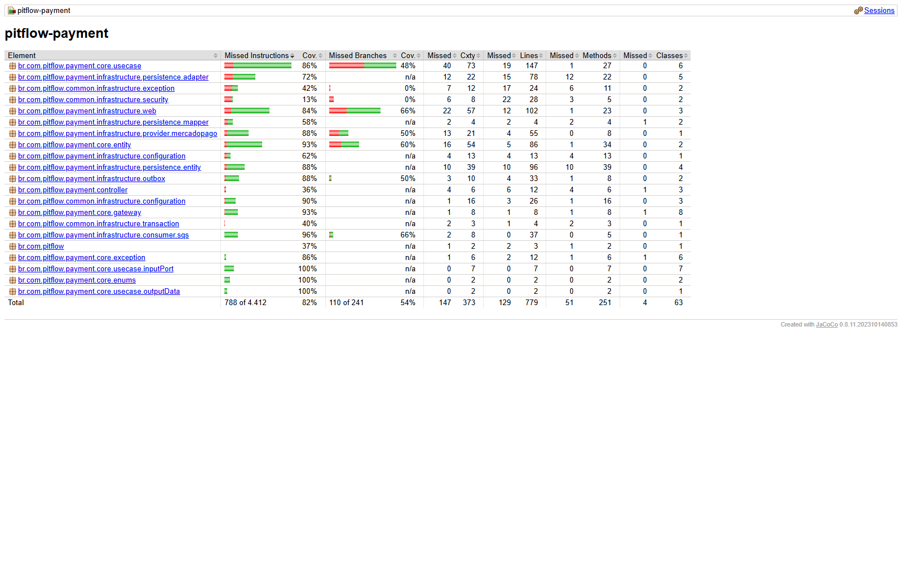

# PitFlow Payment Service

Microserviço responsável pela obrigação financeira das ordens de serviço e pela
integração com o Mercado Pago Checkout Pro.

## Stack

Java 21, Spring Boot 4, Maven, PostgreSQL 16, Liquibase, SQS, Spring Data JPA,
Actuator, Springdoc OpenAPI e Testcontainers.

## Arquitetura

O core (`payment/core` e `common/core`) é Java puro. Spring, HTTP, SQS e JPA
permanecem em `infrastructure`. O `controller` é o agregador de casos de uso; o
`@RestController` é um adapter web.

Fluxo de criação implementado:

```text
CreatePayment (SQS, schemaVersion 1)
  -> valida IDs, valor positivo, moeda BRL e chave de idempotência
  -> cria ou reutiliza o Payment da OS/orçamento
  -> reutiliza um payment_attempt existente, se houver
  -> busca preferência pelo external_reference ou cria uma no Checkout Pro
  -> em transação:
       persiste payment_attempt
       move Payment de CREATED para CHECKOUT_PENDING
       grava PaymentLinkCreated na outbox
  -> remove a mensagem da fila somente após sucesso
```

A chave de idempotência recebida do Orchestrator identifica a SAGA. Repetições
com o mesmo conteúdo devolvem o pagamento e o checkout já existentes; a mesma
chave com conteúdo diferente é rejeitada. Atualmente o comando usa a versão 1
do orçamento e não informa e-mail do pagador.

Fluxo de confirmação implementado:

```text
Webhook Mercado Pago
  -> exige type=payment, data.id consistente e assinatura HMAC-SHA256 válida
  -> deduplica por notificationId + action + paymentId
  -> consulta GET /v1/payments/{id} no Mercado Pago
  -> localiza o Payment pelo external_reference
  -> confere valor e moeda
  -> em transação:
       atualiza payment_attempt e o estado do Payment
       grava o webhook na inbox
       grava PaymentApproved ou PaymentRejected na outbox, quando aplicável
```

Os estados externos `pending`, `in_process` e `in_mediation` atualizam o
Payment, mas não encerram a SAGA. Apenas `approved` e `rejected` geram eventos
finais para o Orchestrator. Webhooks repetidos são idempotentes; pagamentos que
não pertencem ao PitFlow são ignorados.

O publisher da outbox roda no mesmo container. Ele usa claim com
`FOR UPDATE SKIP LOCKED`, lease, retry e backoff, publica na fila do
Orchestrator e marca o evento como `PUBLISHED`. Não existe serviço ou pod de
outbox separado.

## Execução local

```bash
docker compose up -d pitflow-payment-db-local
mvn spring-boot:run
```

Por padrão, consumer, publisher, integração e webhook ficam desabilitados no
ambiente local. As variáveis estão listadas em `.env.example`.

## Endpoints

Com o `context-path` `/payment`:

- `POST /payment/webhooks/mercado-pago`
- `POST /payment/homologation/service-orders/{serviceOrderId}/reject`
- `/payment/swagger-ui/index.html`
- `/payment/v3/api-docs`
- `/payment/actuator/health`

Documentação publicada:

- [Swagger](https://85ufbygqvi.execute-api.us-east-1.amazonaws.com/payment/swagger-ui/index.html)
- [OpenAPI](https://85ufbygqvi.execute-api.us-east-1.amazonaws.com/payment/v3/api-docs)

Localmente:

- `http://localhost:8080/payment/swagger-ui/index.html`
- `http://localhost:8080/payment/v3/api-docs`

Os links publicados foram validados com HTTP 200 em 27/07/2026.

O webhook é público, mas rejeita notificações sem assinatura válida. O Access
Token e a assinatura secreta nunca devem ser enviados ao cliente ou gravados no
repositório.

O endpoint de homologação exige um JWT com `ROLE_MECHANIC` e existe apenas para
demonstrar a compensação da SAGA sem alterar configuração ou refazer deploy. Ele
rejeita o pagamento mais recente da OS quando estiver em `CHECKOUT_PENDING`,
`PENDING` ou `IN_PROCESS`. Uma repetição sobre `REJECTED` é idempotente; estados
finais, especialmente `APPROVED`, retornam conflito. Esse recurso deve ser
removido ou isolado por perfil antes de uso produtivo.

## Configuração do Mercado Pago

- `MERCADO_PAGO_ACCESS_TOKEN`: Access Token de teste usado pelo backend.
- `MERCADO_PAGO_WEBHOOK_SECRET`: assinatura secreta configurada no painel.
- `MERCADO_PAGO_TEST_MODE=true`: seleciona `sandbox_init_point`.
- `MERCADO_PAGO_ENABLED=true`: habilita o adapter.
- `PAYMENT_WEBHOOK_ENABLED=true`: habilita o endpoint.

Pagamentos criados com credenciais de teste não disparam notificações reais.
Use o simulador de Webhooks do painel do Mercado Pago para homologar o receptor.

## Build e testes

```bash
mvn clean verify
docker build -t pitflow-payment:local .
```

O Dockerfile empacota o JAR já produzido e validado pelo Maven, evitando uma
segunda compilação durante o build da imagem. Portanto, execute o Maven antes
do `docker build`. Os testes de integração usam PostgreSQL real via
Testcontainers. H2 não é usado.

O `verify` executa 41 testes unitários com Surefire e 9 testes de integração com
Failsafe/Testcontainers. O JaCoCo agrega as duas etapas no mesmo relatório e
interrompe o build se a cobertura total de linhas ficar abaixo de 80%.

Cobertura validada em 27/07/2026:

| Métrica | Cobertura |
|---|---:|
| Linhas | 83,44% (650/779) |
| Instruções | 82,14% (3.624/4.412) |
| Branches | 54,36% (131/241) |

O relatório HTML local fica em `target/site/jacoco/index.html`. A CI também
publica a pasta completa no artefato `payment-jacoco-<commit-sha>`, disponível
por 14 dias.



## BDD, CI/CD e Kubernetes

O cenário [BDD E2E de compensação](docs/BDD_E2E.md) cria uma OS, avança até
`AWAITING_PAYMENT`, rejeita o pagamento e comprova Payment `REJECTED`,
Operation `CANCELLED`, SAGA `FAILED` e replay idempotente.

O pipeline principal executa build/testes, publica uma imagem imutável
`payment-<commit-sha>` e aplica os manifests Kubernetes no namespace `pitflow`.
O workflow manual `Payment SAGA BDD E2E` executa a especificação Cucumber no
ambiente integrado e publica os relatórios HTML/JSON.

Health:

```text
/payment/actuator/health
```

## Pendências

- reconciliação periódica para webhook perdido;
- eventos de expiração/cancelamento;
- endpoints REST de consulta;
- remover ou isolar por perfil o endpoint acadêmico antes de uso comercial.
